# Digital Logic Gates


## 📌 Overview

This directory contains the implementation and simulation of fundamental digital logic gates. These gates serve as the building blocks for more complex combinational and sequential circuits found elsewhere in this repository.

Each gate includes:
* **Schematic Design:** Created using LTSpice.
* **Truth Table:** Theoretical logic verification.
* **Simulation Results:** Transient analysis waveforms verifying the input/output relationship.

---

## ⚡ Fundamental Gates

### 1. Inverter (NOT Gate)
A single-input gate that outputs the opposite logic level of its input.

**Truth Table**
| Input (A) | Output (Y) |
| :---: | :---: |
| 0 | 1 |
| 1 | 0 |

**Results**
<table>
  <tr>
    <td align="center" width="50%"><b>Circuit Schematic</b></td>
    <td align="center" width="50%"><b>Simulation Waveform</b></td>
  </tr>
  <tr>
    <td align="center">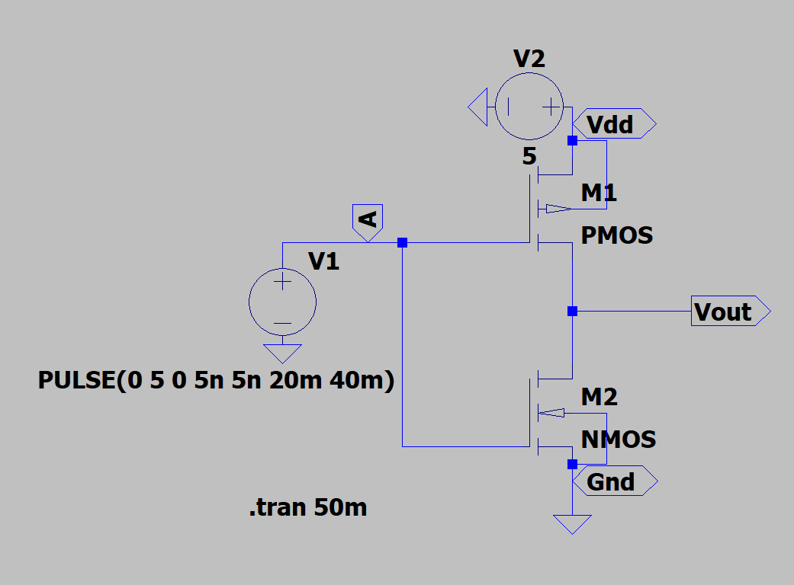</td>
    <td align="center">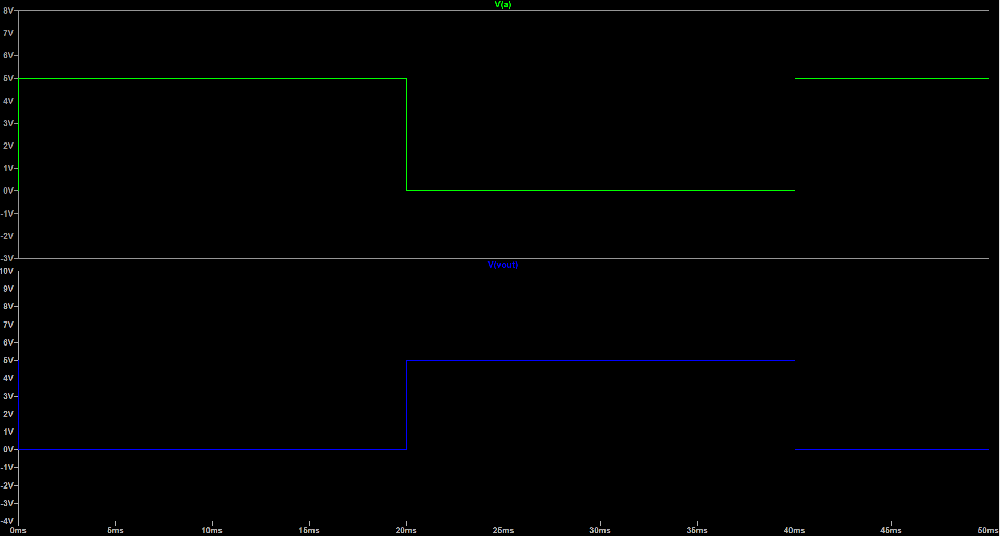</td>
  </tr>
</table>

### 2. AND Gate
The output is high (1) only if **all** inputs are high.

**Truth Table**
| Input A | Input B | Output (Y) |
| :---: | :---: | :---: |
| 0 | 0 | 0 |
| 0 | 1 | 0 |
| 1 | 0 | 0 |
| 1 | 1 | 1 |

**Results**
<table>
  <tr>
    <td align="center" width="50%"><b>Circuit Schematic</b></td>
    <td align="center" width="50%"><b>Simulation Waveform</b></td>
  </tr>
  <tr>
    <td align="center">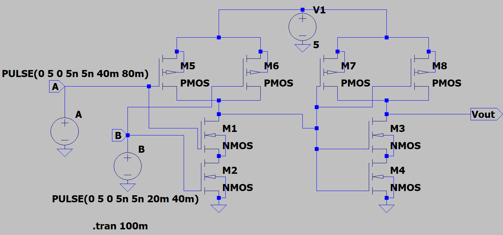</td>
    <td align="center">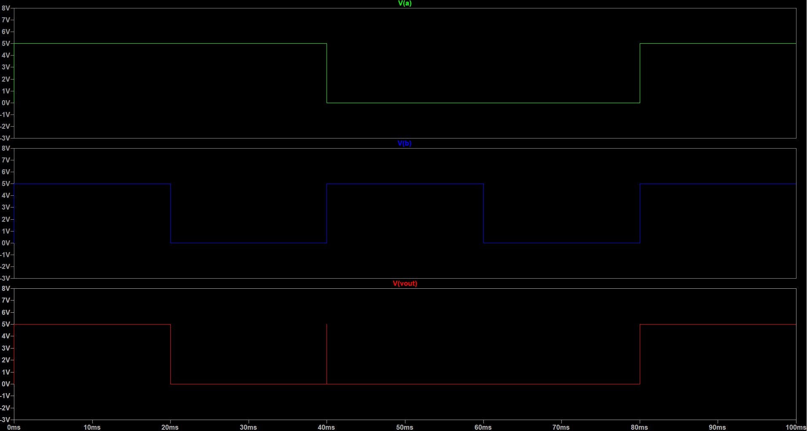</td>
  </tr>
</table>

### 3. OR Gate
The output is high (1) if **at least one** input is high.

**Truth Table**
| Input A | Input B | Output (Y) |
| :---: | :---: | :---: |
| 0 | 0 | 0 |
| 0 | 1 | 1 |
| 1 | 0 | 1 |
| 1 | 1 | 1 |

**Results**
<table>
  <tr>
    <td align="center" width="50%"><b>Circuit Schematic</b></td>
    <td align="center" width="50%"><b>Simulation Waveform</b></td>
  </tr>
  <tr>
    <td align="center">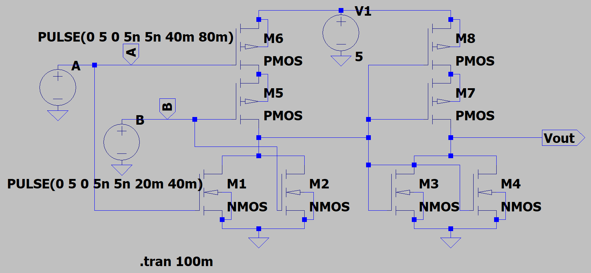</td>
    <td align="center">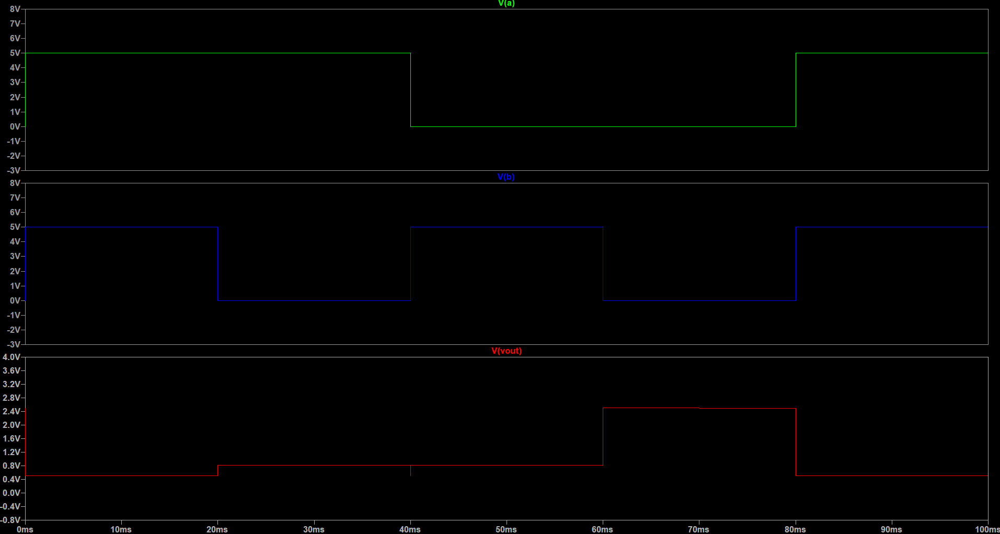</td>
  </tr>
</table>

---

## 🌐 Universal Gates

### 4. NAND Gate (Not-AND)
The output is low (0) only if all inputs are high. It is a universal gate capable of constructing any other logic gate.

**Truth Table**
| Input A | Input B | Output (Y) |
| :---: | :---: | :---: |
| 0 | 0 | 1 |
| 0 | 1 | 1 |
| 1 | 0 | 1 |
| 1 | 1 | 0 |

**Results**
<table>
  <tr>
    <td align="center" width="50%"><b>Circuit Schematic</b></td>
    <td align="center" width="50%"><b>Simulation Waveform</b></td>
  </tr>
  <tr>
    <td align="center">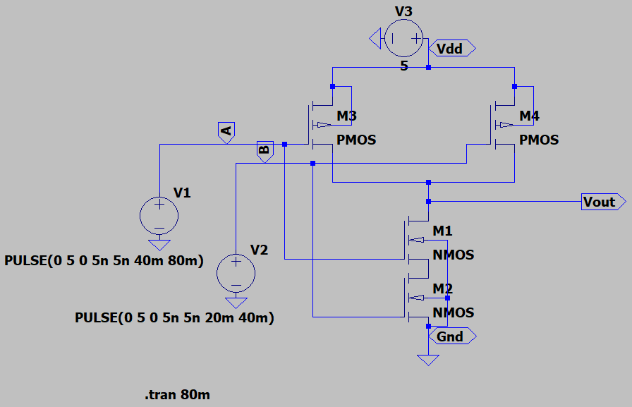</td>
    <td align="center">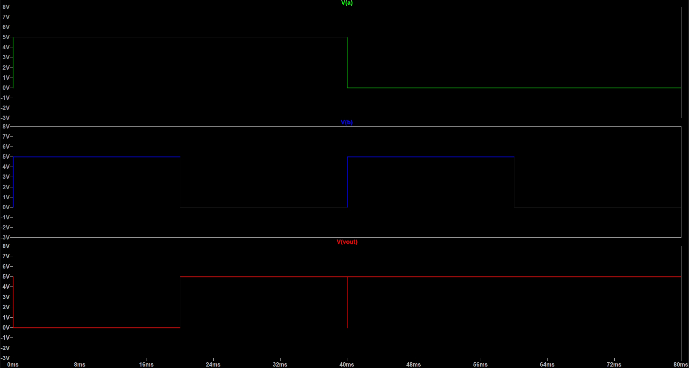</td>
  </tr>
</table>

### 5. NOR Gate (Not-OR)
The output is high (1) only if all inputs are low. Like NAND, it is a universal gate.

**Truth Table**
| Input A | Input B | Output (Y) |
| :---: | :---: | :---: |
| 0 | 0 | 1 |
| 0 | 1 | 0 |
| 1 | 0 | 0 |
| 1 | 1 | 0 |

**Results**
<table>
  <tr>
    <td align="center" width="50%"><b>Circuit Schematic</b></td>
    <td align="center" width="50%"><b>Simulation Waveform</b></td>
  </tr>
  <tr>
    <td align="center">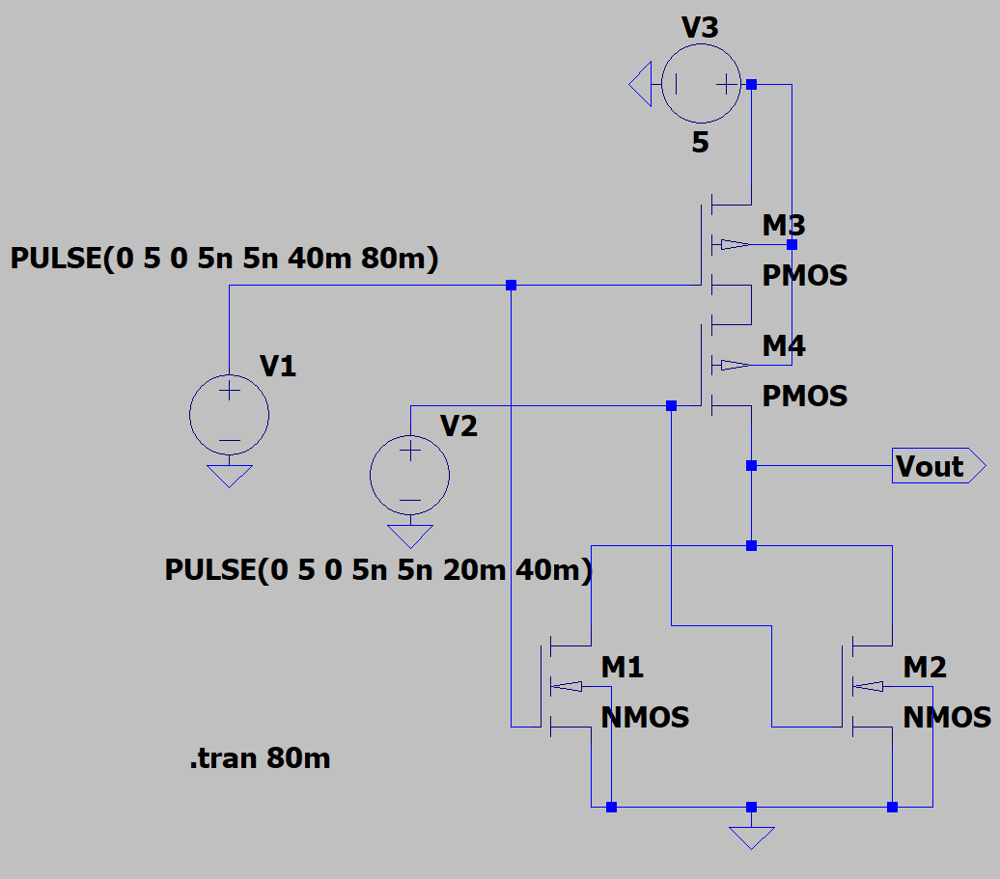</td>
    <td align="center">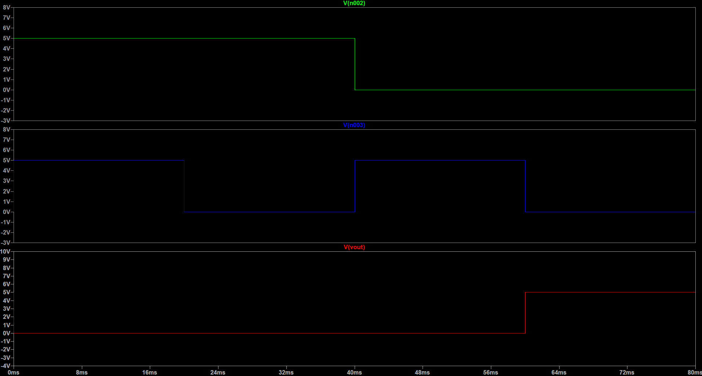</td>
  </tr>
</table>

---

## ➕ Special Gates

### 6. XOR Gate (Exclusive-OR)
The output is high (1) if the inputs are **different**. This is a critical component for arithmetic circuits (Adders).

**Truth Table**
| Input A | Input B | Output (Y) |
| :---: | :---: | :---: |
| 0 | 0 | 0 |
| 0 | 1 | 1 |
| 1 | 0 | 1 |
| 1 | 1 | 0 |

**Results**
<table>
  <tr>
    <td align="center" width="50%"><b>Circuit Schematic</b></td>
    <td align="center" width="50%"><b>Simulation Waveform</b></td>
  </tr>
  <tr>
    <td align="center">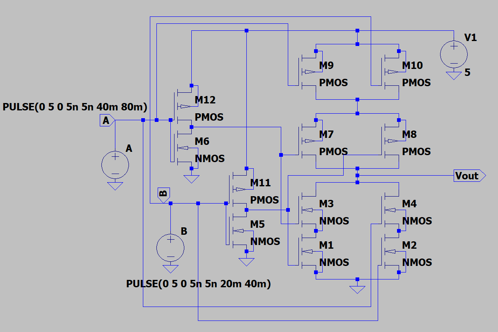</td>
    <td align="center">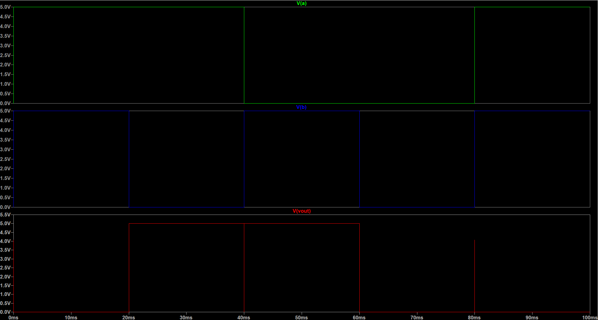</td>
  </tr>
</table>

---

## 📂 Directory Structure

```text
Logic Gates/
│
├── AND.asc             # AND Gate Schematic
├── AND.asy             # AND Gate Symbol
├── OR.asc              # OR Gate Schematic
├── OR.asy              # OR Gate Symbol
├── XOR.asc             # XOR Gate Schematic
├── XOR.asy             # XOR Gate Symbol
├── Inverter.asc        # NOT Gate Schematic
├── Inverter.asy        # NOT Gate Symbol
├── NAND.asc            # NAND Gate Schematic
├── NAND.asy            # NAND Gate Symbol
├── NOR.asc             # NOR Gate Schematic
├── NOR.asy             # NOR Gate Symbol
│
└── README.md           # Documentation
