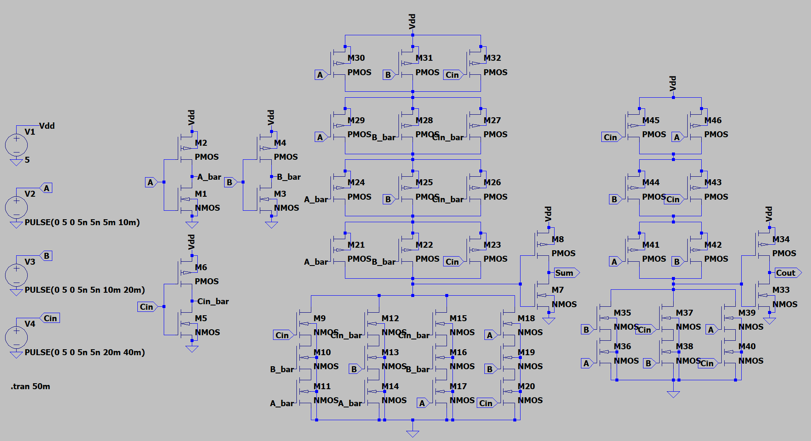
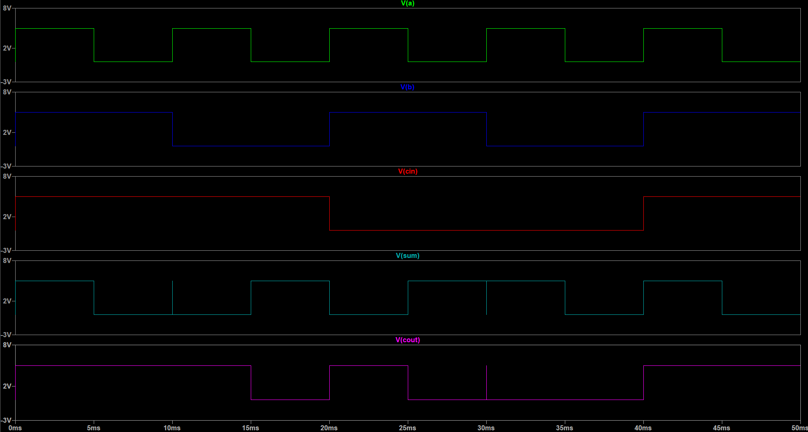

# Arithmetic Circuits


## 📌 Overview

This directory contains the implementation and simulation of combinational arithmetic circuits. These circuits are the fundamental units for performing binary addition, which is the basis for the ALU (Arithmetic Logic Unit) in processors.

Each design includes:
* **Schematic Design:** Created using LTSpice.
* **Truth Table:** Logic verification.
* **Simulation Results:** Transient analysis waveforms verifying the input/output relationship.

---

## ➕ Binary Adders

### 1. Half Adder (HA)
The Half Adder adds two single binary digits (A and B). It has two outputs:
* **Sum (S):** The result of the addition (XOR operation).
* **Carry (C):** The carry bit to the next stage (AND operation).

**Truth Table**
| Input A | Input B | Sum (S) | Carry (C) |
| :---: | :---: | :---: | :---: |
| 0 | 0 | 0 | 0 |
| 0 | 1 | 1 | 0 |
| 1 | 0 | 1 | 0 |
| 1 | 1 | 0 | 1 |

**Results**
<table>
  <tr>
    <td align="center" width="50%"><b>Circuit Schematic</b></td>
    <td align="center" width="50%"><b>Simulation Waveform</b></td>
  </tr>
  <tr>
    <td align="center"></td>
    <td align="center"></td>
  </tr>
</table>

---

### 2. Full Adder (FA)
The Full Adder improves upon the Half Adder by adding three bits: A, B, and a Carry-in ($C_{in}$). This allows it to be chained together to create multi-bit adders (e.g., Ripple Carry Adder).
* **Sum (S):** $A \oplus B \oplus C_{in}$
* **Carry-out ($C_{out}$):** $(A \cdot B) + (C_{in} \cdot (A \oplus B))$

**Truth Table**
| Input A | Input B | Input $C_{in}$ | Sum (S) | Carry ($C_{out}$) |
| :---: | :---: | :---: | :---: | :---: |
| 0 | 0 | 0 | 0 | 0 |
| 0 | 0 | 1 | 1 | 0 |
| 0 | 1 | 0 | 1 | 0 |
| 0 | 1 | 1 | 0 | 1 |
| 1 | 0 | 0 | 1 | 0 |
| 1 | 0 | 1 | 0 | 1 |
| 1 | 1 | 0 | 0 | 1 |
| 1 | 1 | 1 | 1 | 1 |

**Results**
<table>
  <tr>
    <td align="center" width="50%"><b>Circuit Schematic</b></td>
    <td align="center" width="50%"><b>Simulation Waveform</b></td>
  </tr>
  <tr>
    <td align="center"></td>
    <td align="center"></td>
  </tr>
</table>

---

## 📂 Directory Structure

```text
02_Arithmetic/
│
├── Half_Adder.asc      # Half Adder Schematic
├── Half_Adder.asy      # Half Adder Symbol
├── Full_Adder.asc      # Full Adder Schematic
├── Full_Adder.asy      # Full Adder Symbol
│
└── README.md           # Documentation
